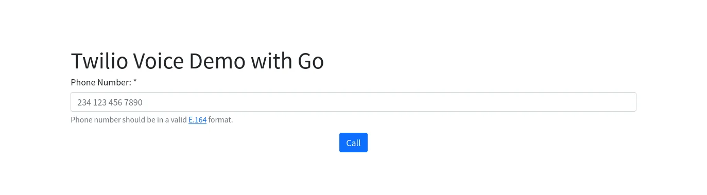
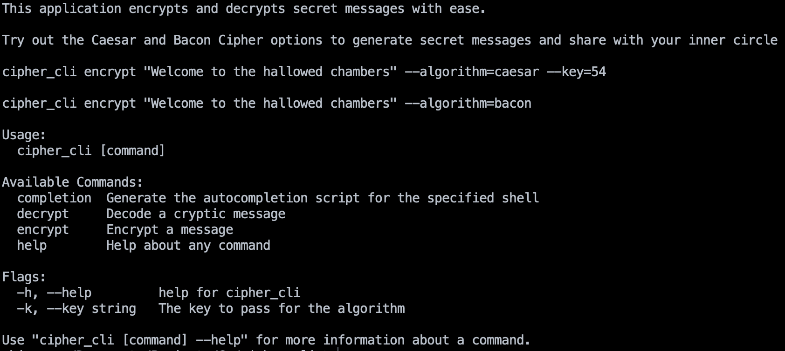

# Introduction

I started working with Go in 2019. I've had tonnes of fun writing small apps to automate data conversion/generation tasks. I have also built demo applications which help Twilio users integrate the SDK into Go-based applications. 

Here's a complete list of Go projects I have worked on in the last four years. 

## [Video chat app](https://www.twilio.com/blog/use-svelte-and-go-build-video-chat-app)
For this project, I built a simple video chat application. Users are allowed to join a room by typing the room name. If there's no existing room with that name, a new room with that name is automatically created. 

For the frontend I used Svelte, while Go was used for the backend. 

You can view the project repository [here](https://github.com/ybjozee/Twilio-Video-Demo). You can also read the accompanying tutorial [here](https://www.twilio.com/blog/use-svelte-and-go-build-video-chat-app).

## [Automated voice call app](https://www.twilio.com/blog/make-spooky-automated-calls-halloween-with-twilio-voice-go)
This was a halloween prank that made it's way to Twilio. Using the voice SDK, I built a simple application to make an automated voice call to any number specified by the user. Should the user answer the call, they would be greeted with a random audio halloween message. 

You can view the project repository [here](https://github.com/ybjozee/Twilio-Voice-Demo). You can also read the accompanying tutorial [here](https://www.twilio.com/blog/make-spooky-automated-calls-halloween-with-twilio-voice-go)

## [Go-based CLI](https://www.twilio.com/blog/use-cobra-build-go-powered-clis)
For this project, I used [Cobra](https://cobra.dev/) to build a CLI for simple encryption/decryption. Cobra was useful for arranging the commands, and flag/argument parsing. 

In addition to encryption and decryption, I added a flag which takes a phone number. Where provided, the CLI sends an SMS with the encrypted content to the provided phone number. 

You can view the project repository [here](https://github.com/ybjozee/Cobra_CLI). You can also read the accompanying tutorial [here](https://www.twilio.com/blog/use-cobra-build-go-powered-clis)

## [Go-based desktop application](https://www.twilio.com/blog/build-cross-platform-desktop-application-go-wails)
For this project, I used [Wails](https://wails.app/) to build a Github desktop client. The client interacts with the Github API to perform the following tasks:

1. View public repositories and Gists
2. View private repositories and Gists for an authenticated user
3. Create a new Gist for the authenticated user

For the frontend, I used React while I used Go for the backend.

<video src="wails.mp4" controls="controls" autoplay>
</video>

You can view the project repository [here](https://github.com/ybjozee/Wails_GitHub_Demo). You can also read the accompanying tutorial [here](https://www.twilio.com/blog/build-cross-platform-desktop-application-go-wails)